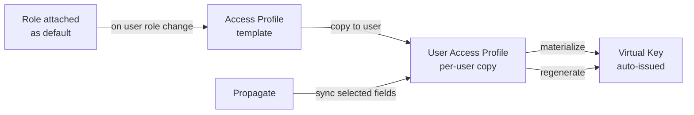

## Overview

An **Access Profile** is a reusable policy template that describes what a user, team, business unit, or customer is allowed to do once they are granted access. When you assign a profile to an entity (directly or by attaching it to a role they hold), Bifrost Enterprise creates a per-user copy of the policy and automatically issues a virtual key for them. Every request made with that key is governed by the profile's provider list, model whitelist, budgets, rate limits, and MCP tool access. Because the profile is consulted on each request, editing it takes effect straight away - there is no need to reissue anyone's key. Users never need to be handed raw keys, and operators never need to write keys by hand.

A user can hold **several access profiles at once**. Together they decide what the user can reach, and one of them pays for each request - see [Multiple profiles per user](#multiple-profiles-per-user).

**Key benefits:**

- **Reusable policy** - Define a profile once (for example, "Engineering") and apply it to every user in a role.
- **Per-user enforcement** - Each user gets an independent copy with isolated budget and rate-limit counters.
- **Layered access** - A user can hold several profiles at once. What they can reach adds up, and if one profile's budget runs out another can cover their requests.
- **Entity-owned keys** - Attach a profile to a team, business unit, or customer to govern the virtual keys it owns, with provider, model, and MCP access and budgets that replace legacy team and customer limits. See [Profiles held by a team, business unit, or customer](#profiles-held-by-a-team-business-unit-or-customer).
- **Role auto-assignment** - Attach profiles to a role and users gaining that role are provisioned automatically.
- **Safe propagation** - Edit the template, then push selected fields (budgets only, MCP only, and so on) to every user copy in one call.
- **Managed virtual keys** - Auto-issued keys are write-protected, so a user cannot weaken their own policy by editing the key directly.
- **Govern user-created keys** - Optionally bring every virtual key a member creates under the profile automatically, not just the auto-issued key.
- **Audit and versioning** - Every change to a profile is recorded with a full snapshot history.

<Info>
	For the full API contract (every endpoint, request and response shape, error codes), see the **Access Profiles** section of the [API
	Reference](/api-reference).
</Info>

---

## How it works

### Template, user copy, virtual key



1. **Template** - The Access Profile is the policy you author. Each policy lives once in the workspace.
2. **How it is granted** - A user gets a profile in one of three ways: you attach it to them by hand, their role grants it, or their identity provider attributes match a mapping rule. Bifrost remembers which, so removing one grant never disturbs the others.
3. **User copy** - Bifrost copies the template to the user, with its own budget and rate-limit counters. Each user's usage is tracked separately, and a user can hold several profiles at once.
4. **Virtual key** - Bifrost issues a virtual key to the user. The key belongs to the user rather than to one profile, so it keeps working as their profiles change, and what it may do comes from whichever profiles they currently hold. It is locked against direct edits so the policy cannot be worked around.
5. **Per-model limits** - Per-model budgets set on the profile appear for each assigned user as their own read-only limit. See [Model Limits](/features/governance/model-limits#per-user-model-limits-enterprise).

### Multiple profiles per user

A user can hold more than one access profile at a time - one from their role, say, and another attached by hand. The profiles do not merge into a single blended policy. Instead:

**Access adds up.** The user can use any provider and any model that *any* of their profiles allows. Giving someone an extra profile can only widen what they can reach; to narrow it, remove a profile or tighten the template.

**One profile pays for each request.** Bifrost picks one of the profiles that allows the request and charges it - its budget, its rate limit, and any per-model limit it sets. The user's other profiles are not charged, and their usage is unaffected.

**If one profile is out of budget, another covers the request.** A user whose Engineering budget is spent keeps working if another of their profiles can still fund the request. Only when every profile that allows the request has run out is the request blocked, and the message names the profile that was tried.

**Usage is tracked per profile.** Each profile has its own counters, so spending against one never eats into another's remaining budget.

<Note>
  Budgets on a user's teams, customers, and business units are charged for every request they make,
  no matter which profile paid for it. Those are separate from profile budgets, not an alternative
  to them.
</Note>

### Profiles held by a team, business unit, or customer

A profile can also be attached to a **team**, a **business unit**, or a **customer**. It applies to
everyone and everything under that entity: its members' requests, and the virtual keys the entity
owns - keys created with its `team_id`, `business_unit_id`, or `customer_id`.

**One profile per entity.** A team, business unit, or customer holds at most one profile. Attaching
another replaces it, and the replaced profile's budgets and usage counters are deleted.

**Access adds up.** A member's requests can reach what any of their profiles allows - their own
profiles, and the profiles of their teams, their business units, and the customers those reach. An
entity profile widens what members reach and never narrows it, and it grants a member who holds no
profile of their own. A key the entity owns reaches what the entity's profile allows, plus what the
profiles of the customers above it allow.

The same holds for keys that are not governed by a profile of their own. A standalone key assigned to
a user reaches what the key itself allows plus what the profiles of that user's teams, business units
and customers allow. A key owned by a team or business unit with no profile reaches what the key
allows plus what the profiles of the customers above that team or business unit allow. Those profiles
are charged for the key's requests, and the key's own budgets still cap it.

**Entity budgets always apply.** An entity's budgets and rate limits are charged for every request
made under it - by a member or with its keys - **whether or not the entity's own profile allowed the
model**. So an exhausted team budget refuses a member's request even when their personal profile
allowed it. The same goes for the entity's per-provider and per-model limits: they are charged for
every request under the entity to that provider or for that model, whichever profile allowed it. A customer reached through both a team and a business unit is charged once; the
same template attached to a team and a business unit is two attachments, charged separately.

**Who pays.** One of the member's permits pays for each request, alongside the entity budgets above.
A member's own profile is preferred when it allows the model and can pay; an entity's profile pays
when none of the member's own can - including when the member's profile is exhausted.

<Note>
  Teams and customers still on legacy budgets keep charging exactly as before, and a customer that
  has moved to a profile also charges the keys of legacy teams under it.
</Note>

#### Profiles replace legacy team and customer limits

Budgets and rate limits set directly on a team or customer are the legacy governance system. An
entity uses **either** an access profile **or** legacy limits, never both. While an entity holds a
profile, setting budgets or a rate limit on it through `PUT /api/governance/teams/{id}` or
`/customers/{id}` is refused with `409` - edit the profile instead. Business units carry no legacy
limits, so attaching a profile to one never needs a migration.

Attaching an existing profile to a team or customer that still has legacy limits is refused with
`409 entity_has_legacy_limits`, listing those limits and a migration plan. There are three ways forward.

**Migrate to a new access profile** (recommended). In the web UI, **Migrate to access profile** - on the
**Access Profile** field under the entity's name, or on its **Usage** view - opens a setup wizard. It
explains what changes, lets you name the new profile and choose the providers and models the
entity's keys may reach, previews exactly what will move, then runs the migration:

- A new access profile is created for this entity alone, from its current budgets and rate limit.
- Its virtual keys can reach the providers you chose: **all providers**, **specific providers** (with the
  models, and optionally the per-provider and per-model limits, you set for each, exactly as on an
  access profile), or **no providers** - every request is refused until you add providers to the profile.
- Every key the entity owns is adopted; budgets, rate limits and providers set on the keys are removed.
- Usage is kept: the profile's budgets and rate limit use the legacy reset windows, so everything
  already spent and used counts against them, on every node of a cluster. From then on the entity's
  limits live on the profile.

The wizard calls the migrate endpoint, first with `dry_run` to preview:

```bash
curl -X POST "$BIFROST/api/governance/teams/$TEAM_ID/access-profile/migrate" \
  -H 'Content-Type: application/json' \
  -d '{"name": "Platform access", "provider_access": "selected", "provider_configs": [{"provider_name": "openai", "allowed_models": ["gpt-5"], "key_ids": ["*"]}], "dry_run": true}'
```

`provider_configs` takes provider configs as an access profile does. `providers` is a shorthand that
grants each named provider with all of its models.

**Remove the legacy limits, then attach** an existing profile - **Remove** on the **Usage** view.

**Skip**: keep the legacy limits and attach no profile. The entity keeps working exactly as before, but
cannot use an access profile.

Attaching an existing profile with `{"profile_id": 42, "migrate": true}` is also accepted. It carries
each legacy budget's spend onto the profile budget with the **same reset window** only; spend on a
window the profile has no budget for is dropped, which the 409 plan marks `"carried": false`.

<Note>
  Nothing changes until you attach a profile to an entity. A deployment that attaches none keeps
  using legacy team and customer limits exactly as before.
</Note>

#### Virtual keys

Attaching a profile **adopts every key the entity owns**: each key's own budgets, rate limits, and
provider configuration are stripped, and from then on it answers to the profile. The attach response
lists them in `adopted_virtual_key_ids`.

There is no separate endpoint for entity keys. Create them through the normal virtual key API with
`team_id`, `customer_id`, or `business_unit_id` as the owner (the three are mutually exclusive).
A key created under an entity that holds a profile is adopted the same way: any budgets, rate limits,
or provider configs in the request are stripped, just as for keys created by a user who holds a
profile. The entity's profile governs the key even when its creator holds a profile of their own.
An existing key cannot be moved under an entity that holds a profile (`409`); create it under the
entity instead.

```bash
curl -X POST "$BIFROST/api/governance/virtual-keys" \
  -H 'Content-Type: application/json' \
  -d '{"name": "reporting-pipeline", "business_unit_id": "'"$BU_ID"'"}'
```

<Warning>
  Detaching a profile deletes its budgets and usage, including spend carried over from legacy limits,
  and does not restore legacy limits. You choose what happens to the entity's virtual keys: **delete**
  them (the default), or **preserve** them with `?preserve_virtual_keys=true`. A preserved key stays
  with the entity but has no providers, budgets or rate limit of its own, so every request it makes is
  refused until you configure it or attach a profile again. Deleting a team, business unit, or
  customer also deletes the profile attached to it.
</Warning>

#### Editing an entity's profile

Template edits reach entity attachments through the same **Propagate** action that updates user
copies, and each entity's spend is preserved across the update. A template that is still attached to
any entity cannot be deleted.

Individual budgets on an entity's profile - its own, a provider's, or a per-model one - accept the same
additive **budget overrides** as a user's copy, from the entity's **Usage** view or through
`PUT /api/governance/{teams|business-units|customers}/{id}/access-profile/budgets/{budget_id}/override`.
Overrides survive template propagation. Legacy team and customer budgets do not take overrides.

### Role auto-assignment

A role can grant **any number** of access profiles. When a role is attached to one or more profiles, two flows kick in:

- **Existing users in that role** - Optionally provisioned at attach time.
- **Users gaining the role later** - Automatically provisioned the moment their role changes.

### Managed virtual keys

Virtual keys issued by an Access Profile are tagged as profile-managed. Direct edits to the key are blocked, except for cosmetic fields like name and description. To change what a managed key allows, edit the template and propagate. This prevents a user with key-edit permission from circumventing the profile.

### Govern virtual keys created by members

By default a profile only governs the virtual key Bifrost auto-issues when the profile is assigned; a member can still create their own standalone keys with any policy they choose. Turn on **Govern virtual keys created by members** to close that gap.

With the toggle on, every virtual key a member of the profile creates is brought under the profile at create time: its providers, model whitelist, budgets, rate limits, and MCP access are replaced with the profile's, the key is attached to the creator, and it becomes profile-managed (edit-locked) like an auto-issued key. All keys a user creates under the profile share the same per-user budget state; each configured budget line still applies separately.

A few things to know:

- **Off by default**, and set per profile — flipping it on one profile does not affect others.
- **Applies to identified users only.** The creator must sign in with their own identity (SSO/SCIM). Keys created from the local admin account or a raw API key are left as ordinary standalone keys.
- **Create-time only.** Turning the toggle on does not sweep up keys a member already created. To bring an existing key under the profile, assign it to the user from the key's edit sheet — it is adopted into their profile on assignment.

### Automatic virtual key rotation

A profile can rotate the virtual keys it manages on a schedule, so credentials expire without anyone remembering to call the rotate endpoint. Set an **interval** (for example `30d`) and, optionally, a **first rotation** time; after each run the next one is scheduled at run time + interval.

When a run comes due, Bifrost enqueues a background job that rotates every managed key in batches of 25. A key counts as managed when it is assigned to a user who holds this profile, which is the same rule that locks managed keys from direct edits. Each key gets a brand-new value exactly as if you had rotated it by hand:

- If `client.vk_rotation_cooldown` is set (Config → Security), the previous value keeps authenticating until the cooldown expires, so callers have time to pick up the new key.
- Leaving it unset, empty, or `0` disables the grace period, so the previous value stops working immediately.

Two dashboard notifications track each run: one when the job starts (profile name, how many keys will rotate, and until when the old values stay valid) and one when it finishes (how many keys rotated, failed, or were skipped).

Safety rules worth knowing:

- **A key is never rotated twice for one scheduled run.** Rotating again would push the previous value out and end the cooldown early. Retries, resumed jobs, catch-up runs after downtime, and keys rotated manually after the schedule fired are all skipped for that run.
- **Manual rotation still works.** The manual endpoints stay available on managed keys; a key rotated manually inside the window is simply skipped by the scheduled run.
- **Cluster-safe.** Every node checks the schedule, but only one job is created per profile and due time, and rotated keys are gossiped to all nodes.
- **Missed runs collapse into one.** If the gateway was down past a due time, the next start performs a single catch-up rotation rather than one per missed period.
- **Deactivated profiles pause.** A deactivated profile is never rotated; reactivating it re-anchors an overdue schedule to now + interval so it does not fire immediately.

---

## Configuration (Web UI)

### Browse and create profiles

1. Navigate to **Workspace** -> **Governance & Access Control** -> **Access Profiles**.

<Frame>
	
</Frame>

The table shows **Name**, **Description**, **Providers**, **Budgets**, **Rate Limit** and per-row actions.

2. Use **Search** or the active/inactive filter to narrow the list. Page size is 25.
3. Click **Create Profile**. The create sheet opens.

### Fill in the basics

<Frame>
	
</Frame>

- **Name** - Required, unique, trimmed. Max 255 characters.
- **Description** - Optional, shown in the list view.

### Configure provider access

In the **Allowed Providers** accordion, add providers from the multi-select. For each provider:

<Frame>
	
</Frame>

- **Allowed Models** - Toggle **All Models** to allow every model, or pick specific models from the search-filtered list. An empty selection denies every model from that provider.
- **Provider Budget** - Add one or more budget lines. Each line has a **max limit** and a **reset duration** (`1h`, `1d`, `1w`, `1M`, `1Q`, `1Y`). You can stack multiple lines with different durations (for example, a hard hourly cap plus a softer monthly cap). A quarterly line can also carry a fiscal quarter start - see [Quarterly budgets](/features/governance/budget-and-limits#quarterly-budgets-and-fiscal-quarters).
- **Maximum Tokens** - Per-provider token rate limit.
- **Maximum Requests** - Per-provider request rate limit.
- **Per-model budgets** - Optionally cap individual models under this provider. These are separate from the provider budget above; each assigned user gets their own copy, counted separately. See [Give one user a per-model budget](#give-one-user-a-per-model-budget).

### Configure global budget and rate limits

Below the provider section, add **Global Budget Configuration** lines (these apply across all providers). Then set global rate limits for tokens and requests using the same number-plus-duration pattern.

### Toggle calendar alignment

Flip **Align to calendar cycle** to reset budgets and rate limits at the start of each calendar period (1st of the month, beginning of the week, midnight UTC for daily) instead of rolling from the creation time. This only applies to durations of one day or longer.

### Toggle member-key governance

Flip **Govern virtual keys created by members** so any virtual key a member of this profile creates is automatically placed under the profile - same providers, model whitelist, budgets, rate limits, and MCP access, attached to the creator, and locked from direct edits. Leave it off (default) to let members create standalone keys freely. See [Govern virtual keys created by members](#govern-virtual-keys-created-by-members) for the full behavior and its limits.

### Schedule automatic key rotation

Under **Automatic key rotation**, pick **Every 7 / 30 / 90 days** or **Custom** and enter a whole number of days or hours (`14d`, `12h`; minimum `1h`, maximum `365d`). Optionally set **First rotation** to control when the first run happens; leave it empty to start one interval from now. Choose **Off** to stop scheduling. The table and detail sheet show the schedule and the next run. See [Automatic virtual key rotation](#automatic-virtual-key-rotation) for what a run does and its safety rules.

<Frame>
	
</Frame>

### Configure MCP tool access

<Frame>
	
</Frame>

- **Virtual MCPs** - Multi-select existing [Virtual MCPs](/enterprise/virtual-mcps) to grant. Selected vMCPs appear as removable badges.
- **MCP Servers** - Multi-select MCP servers. Granting a server means "all tools from this server".
- **Individual Tool Overrides** - Add specific tools with either `include` or `exclude` action. Use this for surgical adjustments that the group + server selection does not express.

<Warning>
	If you grant a whole MCP server (allow-all on that client) and then add an `exclude` override targeting the same client, the form shows a
	conflict alert and saving is rejected. A virtual key can only carry positive allowlists per client; "all minus X" cannot be represented.
</Warning>

### Save and assign

Click **Create**. To make the profile take effect for users, attach it to one or more roles from the Roles page, attach it to a user directly from their User Detail Sheet, or map it from an IdP attribute (see [Attribute mappings](/enterprise/user-provisioning#attribute-mappings)). A user can hold profiles from all three sources at once.

<Frame>
	
</Frame>

For each attachment you can:

- **Set as default for new users** - Auto-assign the profile when users gain this role.
- **Apply to existing users with this role** - Provision the profile to everyone who already holds the role.

### Propagate changes

When you edit an existing profile, the action bar shows **Save** (template-only edit) and **Save and Propagate** (template edit plus immediate propagation to all user copies). The propagate dialog lets you choose exactly which fields to push:

<Frame>
	
</Frame>

- Check the fields to propagate: **Provider Configurations**, **Budgets**, **Rate Limit**, **Virtual
  MCPs**, **MCP Servers**, **MCP Tool Overrides**. - Click **Propagate** to apply. The response
  reports how many users were updated, failed, or skipped.

By default, propagation **preserves usage**: existing users keep their accumulated budget and rate-limit counters where the reset durations match.

### Extend individual budgets for a user

Access profile budgets apply uniformly to everyone assigned the template. To make an exception for one person, add a **budget override** from the User Detail Sheet. An override is additive and leaves the base limit, current usage, and reset schedule untouched:

```text
Effective limit = Base budget + Override amount
```

Choose **for a number of reset cycles** (the current cycle counts as the first) or **until removed**. Overrides propagate cluster-wide and survive profile cloning and propagation, and setting one requires the `AccessProfiles.Update` permission. Programmatically:

```bash
# Add or replace an override
curl -X PUT "$BIFROST_URL/api/users/$USER_ID/access-profiles/$PROFILE_ID/budgets/$BUDGET_ID/override" \
  -H "Authorization: Bearer $TOKEN" \
  -H "Content-Type: application/json" \
  -d '{"amount": 100, "mode": "cycles", "cycles": 2}'

# Remove it
curl -X DELETE "$BIFROST_URL/api/users/$USER_ID/access-profiles/$PROFILE_ID/budgets/$BUDGET_ID/override" \
  -H "Authorization: Bearer $TOKEN"
```

Use `"mode": "forever"` (omitting `cycles`) to keep the override active until it is deleted. The response returns the persisted budget plus its `effective_max_limit`. For the equivalent on a standalone virtual key, see [Budget Overrides](/features/governance/virtual-keys#budget-overrides).

### Edit, duplicate, delete

Each row action exposes:

<Frame>
	
</Frame>

- **Edit** - Opens the same form in edit mode.
- **Duplicate** - Opens the form pre-populated with the original; budgets and rate limits get fresh identifiers on save.
- **Delete** - Asks to confirm. Blocked if any users still hold a copy; detach role attachments or remove user assignments first.

For programmatic configuration (every endpoint, body shape, and error code), see the **Access Profiles** section of the [API Reference](/api-reference).

---

## What you can configure

A profile carries the following pieces of policy. Use the UI walkthrough above for guidance and see the [API Reference](/api-reference) for exact field shapes.

- **Provider access** - For each LLM provider: an allow-all toggle or an explicit model allowlist, plus optional per-provider budgets and rate limits.
- **Global budgets** - Workspace-wide spend caps with reset durations of `1h`, `1d`, `1w`, `1M`, or `1Y`. Multiple budget lines can stack so you can combine a hard short-window cap with a softer long-window cap.
- **Global rate limits** - Token and request caps with the same reset durations.
- **Calendar alignment** - When on, budgets and rate limits reset at the start of each calendar period (midnight UTC, week start, month start) instead of rolling from creation time. Applies to durations of one day or longer.
- **Govern created keys** - When on, every virtual key a member creates is adopted into the profile (same policy, attached to the user, profile-managed). Off by default. See [Govern virtual keys created by members](#govern-virtual-keys-created-by-members).
- **MCP tool access** - Reference [Virtual MCPs](/enterprise/virtual-mcps), and give each MCP client a tool allowlist: every tool, none, or a named set.
- **Automatic key rotation** - An interval (`1h` to `365d`, typically `30d`) and optional first-run time. When due, a background job rotates every managed key, honouring `client.vk_rotation_cooldown`, and posts start/finish notifications. Off by default. See [Automatic virtual key rotation](#automatic-virtual-key-rotation).
- **Tags** - Up to 50 free-form tags for filtering and grouping in the UI.
- **Active flag** - Activate or deactivate without deleting; deactivated profiles are hidden from selection but user copies stay intact.

Profiles can be cloned into new templates, propagated to user copies one field set at a time, and inspected through a version history and an audit log.

---

## Examples

### Auto-assign Engineering profile to the Engineer role

1. Create the profile through the UI or API with the desired provider configs, budgets, and MCP access.
2. From the Engineer role, attach the profile. Toggle "Apply to existing users" to backfill current members.
3. Bifrost issues a virtual key for every member of the Engineer role and continues to auto-issue for any user who later gains the role.

### Force every key an Engineer creates onto the Engineering policy

Prerequisite: the Engineering profile is already assigned to the Engineer role (see the example above), so members have it to govern their keys.

1. Edit the Engineering profile and turn on **Govern virtual keys created by members**. Save.
2. From now on, whenever an Engineer (signed in via SSO) creates a virtual key, it is placed under the Engineering profile automatically - same providers, model whitelist, budgets, rate limits, and MCP access - attached to them and locked from direct edits.
3. To bring keys they created earlier under the policy too, open each key and assign it to the user; it is adopted into their profile on assignment.

### Rotate every Engineering key monthly

1. Under **Config → Security**, set **Cooldown After Virtual Key Rotation** to something like `1h` so callers have time to switch keys.
2. Edit the Engineering profile, set **Automatic key rotation** to **Every 30 days**, and optionally pick a **First rotation** such as the next maintenance window. Save.
3. When the run starts, a notification lists how many keys are rotating and until when the old values keep working; a second notification confirms how many rotated. The profile's **Next Rotation** moves 30 days past the run.

The same schedule can be declared in `config.json`:

```json
{
	"access_profiles": [
		{
			"name": "Engineering",
			"auto_rotation_interval": "30d",
			"provider_configs": [{ "provider_name": "openai", "allow_all_models": true }]
		}
	]
}
```

### Raise the monthly budget without resetting accumulated usage

1. Edit the template and set the new monthly budget.
2. Open the propagate dialog. Check only **Budgets**.
3. Click **Propagate**. The new budget is pushed to every assigned user; each user's current month-to-date usage is preserved (default behavior).

### Tighten MCP access only

1. Edit the template and replace the Virtual MCP reference.
2. Open the propagate dialog. Check **Virtual MCPs**, **MCP Servers**, and **MCP Tool Overrides**. Leave budgets and rate limits unchecked.
3. Click **Propagate**. Budgets and rate limits are not touched; only MCP access changes flow through.

### Give one user an individual per-model budget

1. Navigate to **Budget & Limits → Model Limits** and click **Add Model Limit**.
2. Select a **Provider** and **Model Name**, set **Scope** to `User`, and pick the target user.
3. Add one or more budget lines and any rate limits. Click **Create Limit**.

Or via the API:

```bash
curl -X POST "http://localhost:8080/api/governance/model-configs" \
  -H "Content-Type: application/json" \
  -d '{
    "model_name": "claude-opus-4-8",
    "provider": "anthropic",
    "scope": "user",
    "scope_id": "<user-id>",
    "budgets": [
      { "max_limit": 20.00, "reset_duration": "1M" }
    ]
  }'
```

---

## Next steps

- **[Projects](/enterprise/projects)** - Scope access and spend to a piece of work rather than to a person, chosen per request.
- **[Data Access Control](/enterprise/data-access-control)** - Scope which profiles each operator can see.
- **[RBAC](/enterprise/rbac)** - Define the roles that profiles auto-attach to.
- **[Virtual Keys](/features/governance/virtual-keys)** - Understand the underlying virtual key concept.
- **[Virtual MCPs](/enterprise/virtual-mcps)** - Bundle MCP tools for reuse inside profiles.
- **[Model Limits](/features/governance/model-limits#per-user-model-limits-enterprise)** - How a profile's per-model budgets surface as per-user limits.
- **[Audit Logs](/enterprise/audit-logs)** - Cross-reference profile changes with downstream impact.